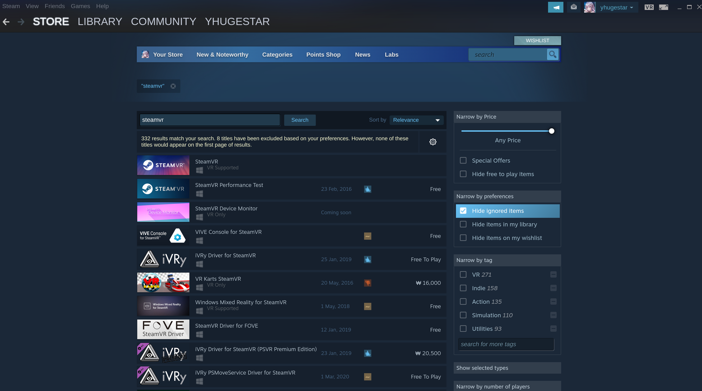

# Vive_Tracker
Vive Tracker 6 DOF Tracking
<p align= "center">
<br/><br/>
</p>

> - HTC Base Station and Vive Tracker
> - Tracking: Support for SteamVR BS1.0 and BS2.0 
> - Weight: 75g
> - Dimensions: 70.9 x 79.0 x 44.1 mm
> - Battery Life: 7.5 hours
> - Field of view: 240 Degrees 
> - Components: Vive Tracker, Dongle, Dongle Cradle (USB-C), USB cable

## Installing Python Dependencies
> Clone the respository:
```
git clone https://github.com/snuvclab/Vive_Tracker.git
cd Vive_Tracker
```
> Note: This code was developed on Ubuntu 20.04 with Python 3.7. Later versions should work, but have not been tested.<br/>
> Create and activate a virtual environment to work in, e.g. using Conda: <br/>

```
conda create -n venv_vive python=3.7
conda activate venv_vive
```
> Install OpenVR library

```
pip install openvr
```

## Setting up SteamVR
> Install Steam:
```
https://cdn.cloudflare.steamstatic.com/client/installer/steam.deb
sudo dpkg -i YourDownloadDirectory/steam_latest.deb
sudo apt-get update
sudo apt upgrade
```

> Install SteamVR: 
After logging in with a Steam Account, install SteamVR. 
<p align= "center">
<br/><br/>
</p>

## Data Preparation

### Format
The code takes an input graph in a csv file. Each row of the file indicates an edge between the two nodes separated by a comma.<br/><br/>
For small sample tests. there are custom test graphs in the  `dataset/custom` folder. <br/><br/>
If you wish to test on real world graphs, please download the network data from Stanford Large Network Dataset Collection here: <a href="https://snap.stanford.edu/data/" target="_blank">SNAP</a>, unzip and place the csv files in the ` dataset/`  folder.  <br/><br/>
To partition other graphs, please match the format of the input graph as stated above.<br/><br/>

### Folder Hierarchy
Once you sucessfully downloaded and unzips dataset files, you should have a directory similar to this:
   ```
    ./dataset/
    ├── custom
    │   └── sample_data.csv
    │   └── test_1.csv
    |   └── test_2.csv
    │   └── test_3.csv
    ├── facebook_clean_data
    |   └──artist_edges.csv  
    |   └──athletes_edges.csv  
    |   └──company_edges.csv  
    |   └──government_edges.csv  
    └── git_web_ml
        └── musae_git_edges.csv
   ```
## Full pipeline
### Diagram of the pipeline
<p align= "center">
<br/><br/>
</p>

#### Steps
<ol>
<li>Label Propagation is run on the input graph for community detection (clustering).</li>
<li>The output of label propagation is preprocessed to produce a text file which follows the format stated above.</li>
<li>KL partitioning algorithm is run on the preprocessed file to produce a text file, with each line indicating the node along with a partitioning group 'A' or 'B'.</li>
<li>Uncoarsening is ran on the partitioned graph to recover the original nodes before community detection.</li>
</ol>

#### Model options
```
  --input               STR    Input graph path.                                    
```
#### Example for running the full pipeline on the Github graph 

```
python demo.py --input dataset/git_web_ml/musae_git_edges.csv
```
#### Makefile example
I have also included a Makefile for compilation, just modify the input path and run:
```
make
```
For those wishing to run only `Label Propagation` and the `KL algorithm`, please follow the instructions on <a href="https://github.com/yc4ny/Graph-Partitioning#community-detection---label-propagation" target="_blank">Community Detection - Label Propagation</a> and <a href="https://github.com/yc4ny/Graph-Partitioning#graph-partitioning---kernighan-lin" target="_blank">Graph Partitioning - Kernighan-Lin</a> section.

## Community Detection - Label Propagation

<p align= "center">
<br/><br/>
</p>
The Label Propagation algorithm is a fast algorithm for finding communities in a graph, while detecting these communites using the network structure alone as its guide and does not require a pre-defined objective function or prior informations about the communities. The quality of community detection is determined with the modularity value.

### Algorithm

<p align= "center">
<br/><br/>
</p>

Clustering the input graph is done by the `label_propagation.py` script which provides the following command line arguments. <br/>

#### Model options

```
  --input               STR    Input graph path.                                   
  --output              STR    Output communities path.                   
  --rounds              INT    Number of iterations.    
```

#### Example for running label propagation on the Github graph

```
python label_propagation/label_propagation.py --input dataset/git_web_ml/musae_git_edges.csv --output outputs/output_LP/musae_git_edges.json --rounds 30
```

Detected communities will be in the form of a `.json` file which can be found in  `outputs/output_LP` folder. <br/>

#### Running Baseline Community Detection Algorithms

Other community detection algorithms such as the  <a href="https://en.wikipedia.org/wiki/Girvan%E2%80%93Newman_algorithm" target="_blank">Girvan Newman</a>, and the <a href="https://en.wikipedia.org/wiki/Louvain_method" target="_blank">Louvain</a> algorithm can be found in `baseline/community_detection` folder. Update the `test.py` according to the algorithm you wish to test, and run the file.

## Graph Partitioning - Kernighan-Lin

<p align= "center">
<br/><br/>
</p>
The <a href="https://en.wikipedia.org/wiki/Kernighan%E2%80%93Lin_algorithm" target="_blank">Kernighan-Lin (KL)</a>, algorithm takes an undirected graph as input and partitions the vertices into two disjoint subsets A,B of equal(or nearly equal) size, in a way that minimizes the sum of the weights of the subsets of edges that cross from A,B.

#### Model options

```
  --input    STR    Input graph path. 
  --output   STR    Partitioned graph path.                                           
```

#### Example for running KL on the Github graph

```
python baseline/kl_partitioning/kl.py --input dataset/git_web_ml/musae_git_edges.csv
```

Partitioned graph will be in the form of a `.txt` file which can be found in  `outputs/output_KL` folder. <br/>

### Algorithm
<p align= "center">
<br/><br/>
</p>
