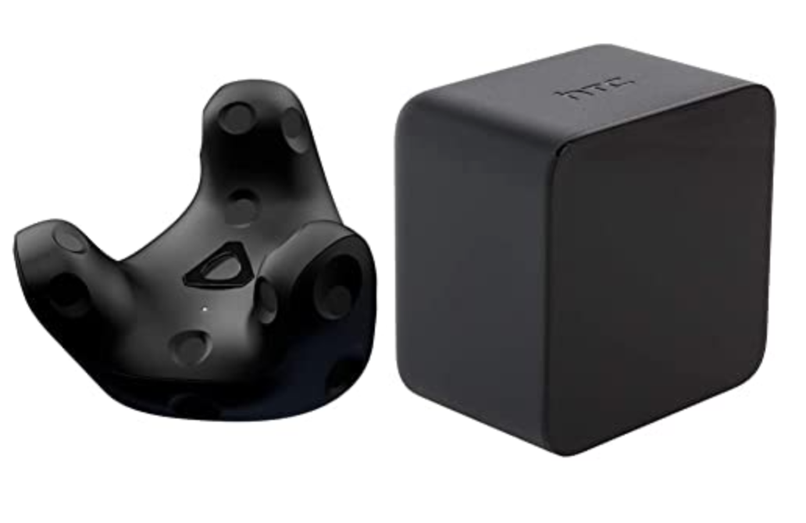

# Vive_Tracker
Vive Tracker 6 DOF Tracking
<p align= "center">
<br/><br/>
</p>

> - HTC Base Station and Vive Tracker
> - Tracking: Support for SteamVR BS1.0 and BS2.0 
> - Weight: 75g
> - Dimensions: 70.9 x 79.0 x 44.1 mm
> - Battery Life: 7.5 hours
> - Field of view: 240 Degrees 
> - Components: Vive Tracker, Dongle, Dongle Cradle (USB-C), USB cable

## Installing Python Dependencies
> Clone the respository:
```
git clone https://github.com/snuvclab/Vive_Tracker.git
cd Vive_Tracker
```
> Note: This code was developed on Ubuntu 20.04 with Python 3.7. Later versions should work, but have not been tested.<br/>
> Create and activate a virtual environment to work in, e.g. using Conda: <br/>

```
conda create -n venv_vive python=3.7
conda activate venv_vive
```
> Install OpenVR library

```
pip install openvr
```

## Setting up SteamVR
> Install Steam:
```
https://cdn.cloudflare.steamstatic.com/client/installer/steam.deb
sudo dpkg -i YourDownloadDirectory/steam_latest.deb
sudo apt-get update
sudo apt upgrade
```

> Install SteamVR: 
After logging in with a Steam Account, install SteamVR (Store -> Search for "SteamVR")
<p align= "center">
<br/><br/>
</p>

> Remove HDM requirement:
Since we do not have the Vive HMD (Head Mounted Display) you have to change a setting file. 
You can find the <b>default.vrsettings</b> config file in:
```
home/yourDirectory/.local/share/Steam/steamapps/common/SteamVR/resources/settings/default.vrsettings
eg. /home/yc4ny/.local/share/Steam/steamapps/common/SteamVR/resources/settings/default.vrsettings
```
Change the <b>requireHmd: True</b> to <b>requireHmd: False</b>
<p align= "center">
<br/><br/>
</p>

> Restart SteamVR
If you have run SteamVR in advance, please restart SteamVR. 
You can restart quickly by clicking the <b>VR</b> button on the top right corner of Steam.
<p align= "center">
<br/><br/>
</p>

## Running the Tracker 
You can run the tracker by running
```
python run_tracker.py -f FrequencyValue
eg. python run_tracker.py -f 30
```
The <b>-f</b> flag indicates the frequency of location update, so if you are using a camera which takes video as 30fps, you can add the <b>-f 30</b> flag. 
<p align= "center">
<br/><br/>
</p>

## Visualizing Camera Trajectory
To be updated...


